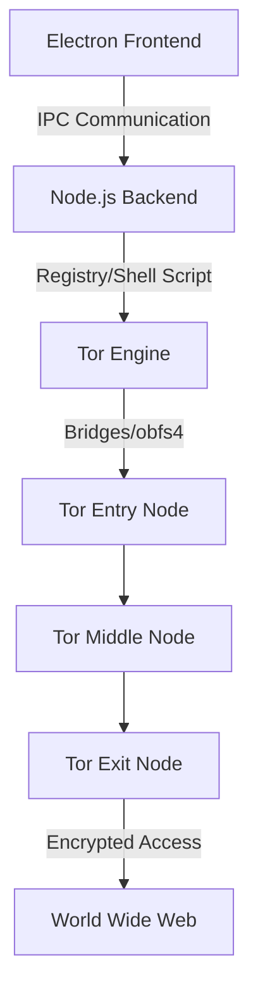

# FreeProxy VPN - Premium Tor-Backed Experience

<p align="center">
  
</p>

<p align="center">
  
  
  
  
</p>

---

## 🛡️ Project Overview

**FreeProxy VPN** is a robust, premium open-source VPN solution built on the **Tor Network**. Unlike traditional VPNs that may log your data, FreeProxy ensures 100% encryption and anonymity by routing your traffic through three different global nodes. It is specifically optimized for Windows power users who demand privacy without compromising on ease of use.

---

## ✨ Key Features

| Feature | Description |
| :--- | :--- |
| 🛡️ **Military-Grade Privacy** | Uses Tor’s 3-layer encryption, making your traffic virtually untraceable. |
| ⚡ **Smart Caching** | Enhanced persistence layer allows connection in just 3-5 seconds after initial bootstrap. |
| 🛑 **Advanced Kill Switch** | Instantly blocks internet access if the VPN connection drops to prevent IP leaks. |
| 🌐 **Split Tunneling** | Exclude specific websites or domains from the VPN tunnel with ease. |
| 🌉 **Obfs4 Bridge Support** | Built-in support for **Lyrebird (obfs4)** to bypass strict ISP firewalls and censorship. |
| 💎 **Premium UI/UX** | Modern Dark Mode interface with real-time ping tracking and reverse countdowns. |

---

## 📸 Screenshots


---

## 🛠️ Installation & Setup

Follow these steps to set up the project locally:

### 1. Clone the Repository
```bash
git clone [https://github.com/Zero-Asif/FreeVPN-PC-App.git](https://github.com/Zero-Asif/FreeVPN-PC-App.git)
```

### 2. Install Dependencies
```bash
cd FreeVPN-PC-App
npm install
```

### 3. Run the Application
```bash
npm start
```

> [!IMPORTANT]
> Ensure that the `Tor/data` folder contains the required `geoip` and `geoip6` files. The app automatically requests **Administrator** privileges to configure system proxy settings effectively.

---

## 🏗️ Technical Architecture



---

## 👨‍💻 Developed By

[](https://github.com/Zero-Asif)

---

<p align="center">
  
  
</p>