<p align="center">
  
</p>

<p align="center">
  
  
  
  
  
  
</p>
<p align="center">
  
  
  
  
  
  
</p>

<h3 align="center">Pick a country. Everything on this PC comes out there — including where the web thinks you are standing.</h3>

<p align="center">
  <b>FreeProxy VPN</b> drives a bundled <code>tor.exe</code> over loopback, points Windows at it,
  and then does the part almost nothing else does:<br>it makes your <b>browser's geolocation agree
  with your exit country</b>, in 14 browsers, and tells you honestly where it cannot.
</p>

<p align="center">
  <sub>No account · no subscription · no telemetry · no server belonging to this project · MIT licensed</sub>
</p>

<p align="center">
  
</p>

<p align="center">
  <sub>
    <b>1</b> <a href="#getting-it-running">install</a> &nbsp;·&nbsp;
    <b>2</b> <a href="#the-tour">pick a country</a> &nbsp;·&nbsp;
    <b>3</b> <a href="#one-press-of-connect">connect</a> &nbsp;·&nbsp;
    <b>4</b> <a href="#leak-protection-and-a-kill-switch-that-means-it">the machine follows</a> &nbsp;·&nbsp;
    <b>5</b> <a href="#what-a-switch-wipes-and-why">switch, or split</a> &nbsp;·&nbsp;
    <b>6</b> <a href="#it-writes-down-what-it-did">check it yourself</a>
  </sub>
</p>


## What this is, and what it is not

Most "free VPN" apps ask you to trust a company. This one has no company to
trust: there is no account, no server owned by this project, and nothing to
log in to. It starts the real Tor client on your own machine and wires Windows
into it.

| It **does** | It **does not** |
|---|---|
| Route the whole machine through Tor — every app, not just a browser | Encrypt anything Tor does not; a site on plain HTTP is still plain HTTP to the exit |
| Let you pin the exit to one of **74 countries** and switch without a reconnect | Promise a country is available right now; if a country has no usable exit, it says so and offers alternatives |
| Make `navigator.geolocation` report the connected country's real coordinates in **14 browsers** | Fake the Windows location provider — that has no supported route, so the position is **withheld** instead ([why](#geolocation-the-part-that-is-usually-missing)) |
| Close DNS, IPv6 and pre-existing sockets so they cannot leak around the tunnel | Hide from your ISP that you are using Tor, unless a bridge round happens to work |
| Undo every system change by name on disconnect and on uninstall | Take a snapshot of your old proxy settings — it deletes what it wrote instead |
| Print exactly what it did, per browser, in a log you can open from the UI | Send that log, or anything else, anywhere |

> [!IMPORTANT]
> Tor is a low-latency anonymity network, not a bandwidth service. Expect
> ordinary browsing to work well and large downloads or video to be slower than
> a commercial VPN. That is the trade you are making for not having to trust
> anybody.


## The tour

<table>
<tr>
<td width="50%" valign="top">
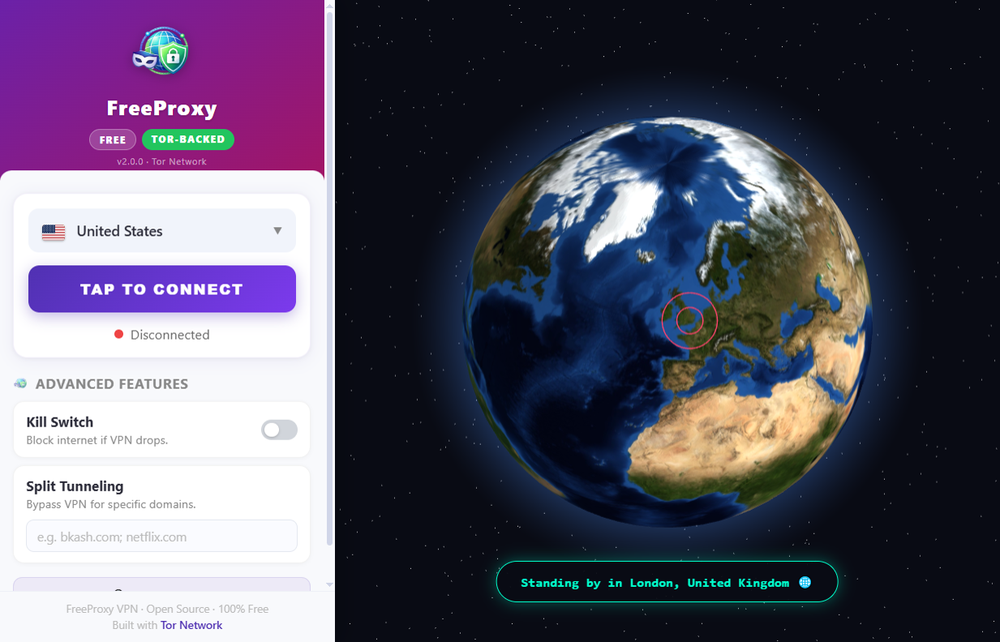
<p align="center"><b>1 · Standing by</b><br><sub>The globe centres on where you actually are, and says so. No connection has been made yet.</sub></p>
</td>
<td width="50%" valign="top">
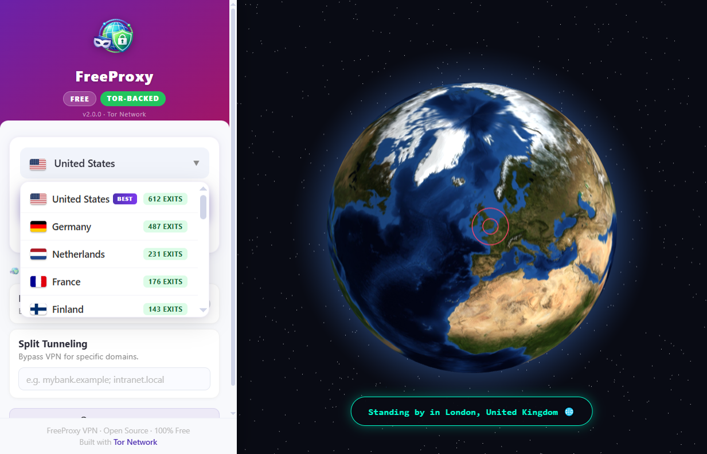
<p align="center"><b>2 · Choose an exit</b><br><sub>74 countries, each with the number of usable exits read from the live Tor relay index.</sub></p>
</td>
</tr>
<tr>
<td width="50%" valign="top">
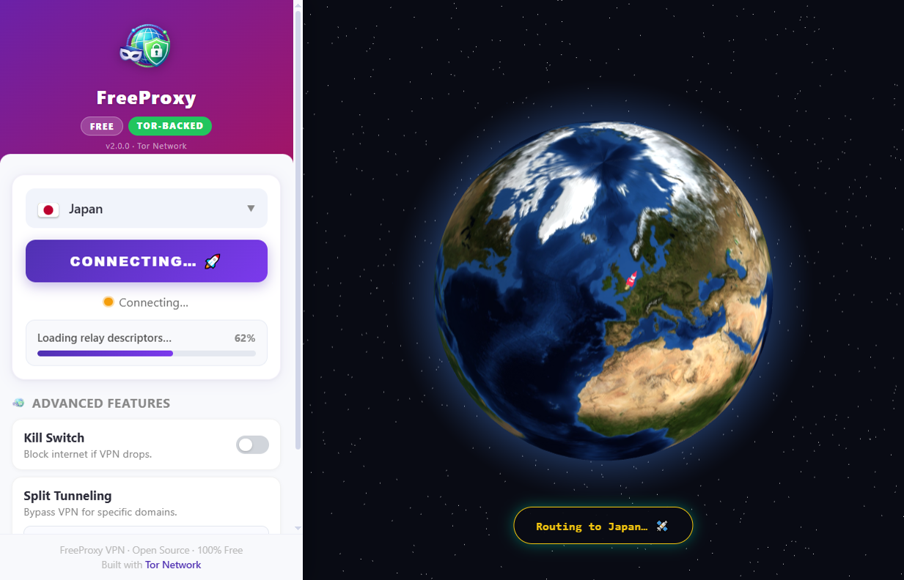
<p align="center"><b>3 · Connecting</b><br><sub>The percentage is Tor's own bootstrap, not an animation. The phase text is the phase Tor reported.</sub></p>
</td>
<td width="50%" valign="top">
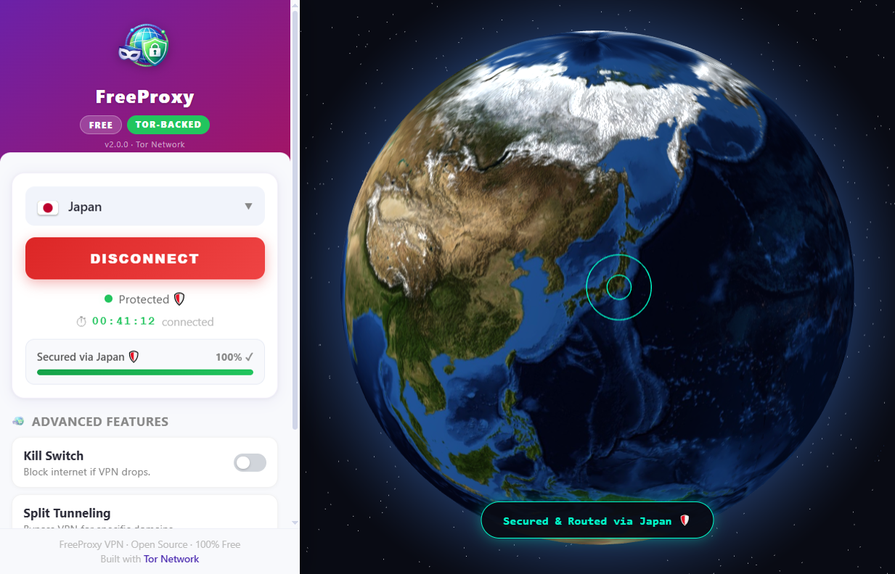
<p align="center"><b>4 · Connected</b><br><sub>The ring moves to the exit city, the badge turns green, and the session clock starts.</sub></p>
</td>
</tr>
</table>

Switching country while connected does **not** drop the tunnel: the app rewrites
`ExitNodes`, reloads Tor's configuration over the control port, verifies the new
exit through the circuit, and re-broadcasts the new coordinates to every open
browser.

> [!WARNING]
> **A country switch clears each browser's history, cache and cookies — all of
> it, so you are signed out of every site.** That is deliberate and it is the
> price of the switch actually taking effect; a site that cached the old country,
> or holds it in a cookie set before the extension ever saw it, will keep showing
> the old country otherwise. The whole story is in
> [what a switch wipes, and why](#what-a-switch-wipes-and-why). A **disconnect**
> does not do this.


## Getting it running

<table>
<tr>
<td width="34%" valign="top">

### 1 · Install

Run **`FreeProxy-VPN-Setup-2.0.0.exe`**. It installs per machine and asks for
administrator **once**.

That prompt is not cosmetic: the extension is offered from `HKLM`, and DNS,
IPv6 and the firewall rules are machine-wide settings. There is no second
elevation prompt later — not on connect, not on a country switch.

</td>
<td width="33%" valign="top">

### 2 · Restart, if it asks

The installer does the browser work while nothing is running, and the app then
offers **one** restart, once.

It is offered only when Windows itself said a restart is pending, or when the
boot pass has real work queued. A clean install on a quiet machine defers
nothing and asks for nothing.

</td>
<td width="33%" valign="top">

### 3 · Connect

Open it, pick a country, press the button. Nothing to sign up for, nothing to
paste in, no configuration file to import.

The first run names the browsers it found on this PC and says what it did to
each one — including the ones it could not reach.

</td>
</tr>
</table>

<table>
<tr>
<td width="50%" valign="top">
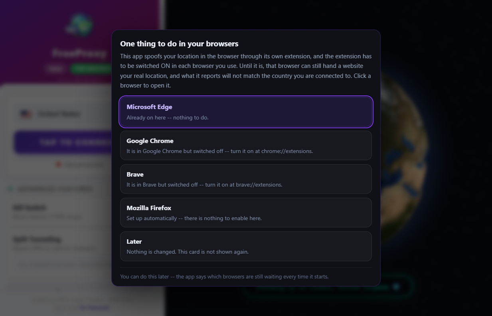
<p align="center"><b>The first-run card</b><br><sub>Only browsers you actually have are listed, and every line is a read-back rather than a plan.</sub></p>
</td>
<td width="50%" valign="top">
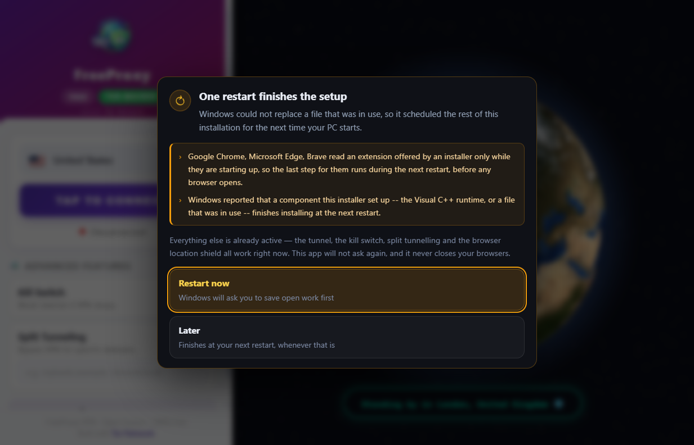
<p align="center"><b>The one restart</b><br><sub>Offered once and never taken for you. <b>Later</b> leaves everything else working.</sub></p>
</td>
</tr>
</table>

<details>
<summary><b>Everything the installer does, in the order it does it</b></summary>

`installer.nsh` contains **no browser-specific registry path at all**. It runs
the app instead, because only the app can see which browsers are on *this*
machine, sign a package for them and write the entry for the id it just made.

1. **Firewall.** Two named outbound-allow rules — `FreeProxy Tor Engine` for
   the unpacked `tor.exe` and `FreeProxy App` for the app itself. Each is
   deleted before it is added, so a repeat install cannot stack duplicates.
2. **Visual C++ runtime.** Reads
   `HKLM\SOFTWARE\Microsoft\VisualStudio\14.0\VC\Runtimes\x64`. If it is
   missing, the bundled `vc_redist.x64.exe` runs `/quiet /norestart`; if even
   that file is absent the installer fetches it from `aka.ms`. Its exit codes
   **3010** and **1641** are the one place in the whole install where a restart
   can legitimately become necessary, and they are read, never assumed.
3. **Directories.** `%LOCALAPPDATA%\FreeProxy VPN\logs` and
   `…\Tor\data\keys`. The real state directory,
   `C:\ProgramData\freeproxy-vpn`, is created by the app itself so that there
   is only one place that decides where it lives.

4. **`"FreeProxy VPN.exe" --fp-setup`**, elevated, headless. Detects the
   installed browsers, stages and RSA-signs the extension into a `.crx`, writes
   the force-install entry for the id that signing just produced, and schedules
   the boot pass — the SYSTEM task that finishes the browser work at the next
   startup, *before any browser has started*, which is the only moment a
   Chromium fork reads an external-extensions offer. If Windows said a restart
   is pending, `--fp-reboot-pending` is passed through to this step, which
   checks `PendingFileRenameOperations` as well before it leaves a marker.
5. **Markers.** `HKLM\Software\FreeProxy VPN` gets `InstallPath`, `Version`
   (electron-builder's own, so it cannot drift from `package.json`) and
   `FirewallConfigured`.

What step 4 reports, and what each answer means:

| Code | Meaning |
|---|---|
| `0` | Force-installed automatically. Nothing for you to do. |
| `10` | Staged and signed, but every installed browser refuses the automatic route. You get `HOW-TO-ENABLE.txt` and one in-app click, once, ever. **On a personal PC this is the normal outcome, not a failure** — measured 2026-09-01: Chrome, Brave *and* Edge all require the machine to be domain-joined, Azure-AD-joined or enrolled in Chrome Browser Cloud Management before an off-store extension can be forced. |
| `3` | Staging failed. |
| `4` | Timed out; the app finishes it on first run. |
| `1` | Crashed; the app retries on first run. |

</details>


## How it works

<p align="center">
  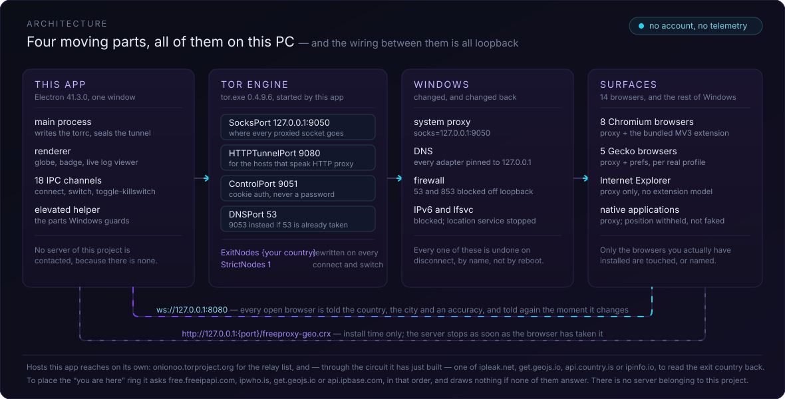
</p>

| Part | What it is |
|---|---|
| **This app** | Electron 41.3.0, one window. The main process writes the `torrc` and seals the tunnel, the renderer draws the globe and the live log, 18 IPC channels connect the two, and the parts Windows guards run elevated. |
| **The Tor engine** | The bundled `tor.exe` 0.4.9.6, started by this app with a configuration this app writes: `SocksPort 9050`, `HTTPTunnelPort 9080`, `ControlPort 9051` — cookie auth, never a password — and `DNSPort 53`, falling back to `9053` when something already holds 53. |
| **Windows** | System proxy, per-adapter DNS, firewall rules, IPv6 and the location service. Each is changed by name, and each is changed back by name on disconnect — not at the next reboot. |
| **The surfaces** | 8 Chromium browsers (proxy **and** the bundled MV3 extension), 5 Gecko browsers (proxy and prefs, per real profile), Internet Explorer (proxy only — it has no extension model), and every other program on the machine (proxy; position withheld, never faked). |

Two further loopback channels run underneath all of it.
`ws://127.0.0.1:8080` carries the country, the city and an accuracy to every
open browser, and tells them again the moment any of it changes. A one-time
HTTP server hands the signed extension to a browser during install and stops
the instant it has been taken.

### One press of Connect

<p align="center">
  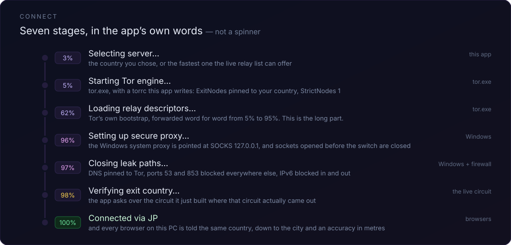
</p>

Every percentage in that diagram is a number the app actually sends, and every
line of text is a string it actually shows. Between 5% and 95% the app is not
counting anything — it is forwarding Tor's own bootstrap verbatim, which is why
the bar crawls there and why the phase names are Tor's vocabulary instead of
something friendlier that would mean less.

Stage **98** is the one that earns the rest. Instead of trusting the
`ExitNodes` line it just wrote, the app asks — *through the circuit it has just
built* — where that circuit actually came out. If the answer is not the country
you picked, it says so and offers the countries that do have usable exits right
now.


## Geolocation, the part that is usually missing

A proxy changes the IP address a website sees. It does not change what
`navigator.geolocation` tells that website — so a site that asks for your
position still gets your real street, in the country you were trying to leave.
Every *"the VPN says Japan but Maps says home"* complaint is this one gap.

<p align="center">
  
</p>

So the app makes the browser's position agree with the exit country. Connect to
Japan and `navigator.geolocation` returns Tokyo's real coordinates with a
plausible accuracy — in every supported browser, in frames and `about:blank`
documents too, and in this app's own window through the DevTools protocol at
the same instant.

> [!NOTE]
> **The two amber rows are not a to-do list.** Windows exposes no supported way
> to inject coordinates into its own location provider; that was measured, and
> the documented *Default Location* setting changes nothing the provider
> actually reports. So for Internet Explorer, WebView hosts and native
> applications the position is **withheld** rather than faked — `lfsvc` is
> stopped and the sensor denied — and the log names which surfaces got which
> treatment every time you connect. A shield can be honest. A coverage claim
> nothing read back could not be.

### The 14 browsers, by name

<table>
<tr>
<th align="left" width="42%">Chromium — proxy, extension, policy</th>
<th align="left" width="34%">Gecko — proxy and prefs</th>
<th align="left" width="24%">No extension model</th>
</tr>
<tr valign="top">
<td>

`Microsoft Edge` · `Google Chrome` · `Brave` · `Vivaldi` ·
`Opera` · `Opera GX` · `Yandex Browser` · `Chromium`

</td>
<td>

`Firefox` · `Waterfox` · `LibreWolf` ·
`Pale Moon` · `SeaMonkey`

</td>
<td>

`Internet Explorer`

</td>
</tr>
</table>

A browser that is not installed is never touched and never named. Gecko
profiles are enumerated per browser, so a second Firefox profile gets the same
prefs as the first rather than being silently skipped.

<details>
<summary><b>How the extension actually gets in, and why there are four routes</b></summary>

The extension is not on any store in this build. The app generates an RSA key
on first setup, signs `Extension/` into a `.crx` with it, and serves that file
from its own loopback HTTP server. The extension id is derived from that key,
so it is *this machine's* id — which is also why nothing in the installer can
hardcode it.

| Route | Where | Note |
|---|---|---|
| `ExtensionInstallForcelist` | numbered `REG_SZ` slots under each fork's policy key | The textbook route. Also the one an unmanaged Windows PC throws away. |
| `ExtensionSettings` | **one** `REG_SZ` holding a JSON dictionary of every extension the machine has a policy for | Removal is genuinely different here: our key cannot be deleted on its own, so the value is parsed, our entry dropped, and the rest written back byte-for-byte in meaning. |
| the fork's own external-extensions provider | `HKLM\SOFTWARE\<vendor>\[<product>\]Extensions\<id>` | **This is the route that reaches Chrome and Brave at all.** An off-store force-install *policy* is discarded by an unmanaged Chromium; an external-extensions *offer* is not. |
| `ExtensionInstallAllowlist` | a bare id in a numbered slot | Written last, and never removed on evidence of its own — a bare id says nothing about who wrote it, and a workplace permitting one extension by id writes a byte-identical value. |

> [!IMPORTANT]
> **Measured 2026-09-01, and stated because it is true:** Chrome, Brave *and*
> Edge all refuse an off-store force-install unless the machine is
> domain-joined, Azure-AD-joined or enrolled in Chrome Browser Cloud
> Management. On an ordinary personal PC the automatic route therefore does
> **not** land, and what does the work is the external-extensions offer, which a
> Chromium fork reads only while it starts — hence the boot pass, and hence the
> one restart. Where even that cannot apply you get `HOW-TO-ENABLE.txt` and one
> click in the popup, once, ever. The app says which of these happened; it never
> reports an install it did not read back.

</details>


## The browser extension

Bundled, MV3, `minimum_chrome_version: 111`. It is not a second VPN: it holds no
keys and contacts no network of its own — the only socket it opens is
`ws://127.0.0.1:8080`, where it listens for the country the app is on. It is the
thing that makes `navigator.geolocation` agree with the exit. With the app shut
down it spoofs nothing and reports nothing; the one job it keeps is releasing the
proxy it was holding, so a closed app cannot leave a browser with no internet.

<table>
<tr valign="top">
<td width="25%">
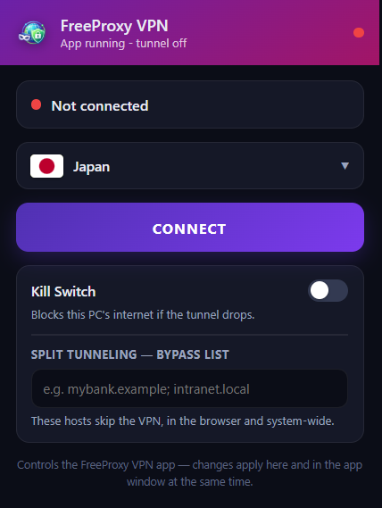
<p align="center"><sub>The app is running, the tunnel is off — and the popup says exactly that.</sub></p>
</td>
<td width="25%">
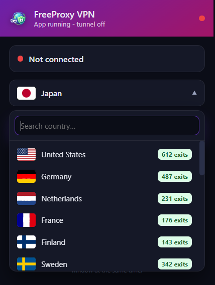
<p align="center"><sub>Every exit country, its real flag out of the package, live exit counts.</sub></p>
</td>
<td width="25%">
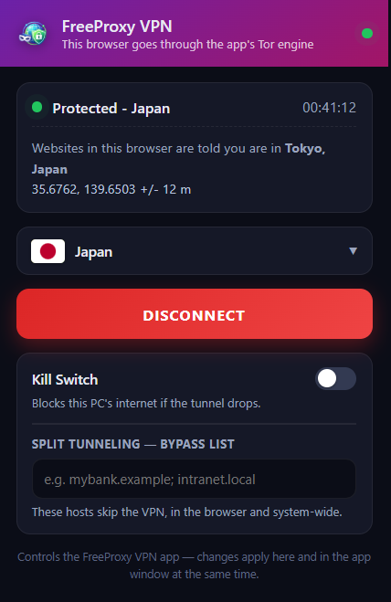
<p align="center"><sub>Connected, with the coordinates <i>this</i> browser is handing to websites.</sub></p>
</td>
<td width="25%">
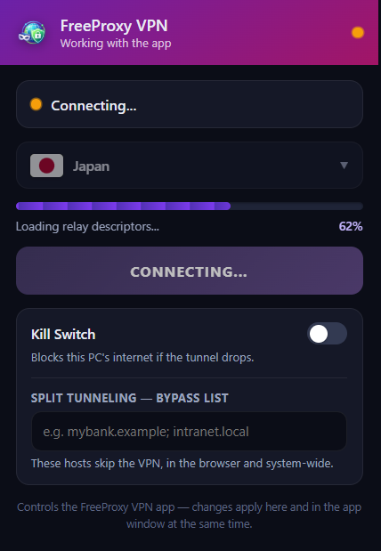
<p align="center"><sub>The app's own bootstrap progress, carried in — not invented here.</sub></p>
</td>
</tr>

<tr valign="top">
<td width="25%">
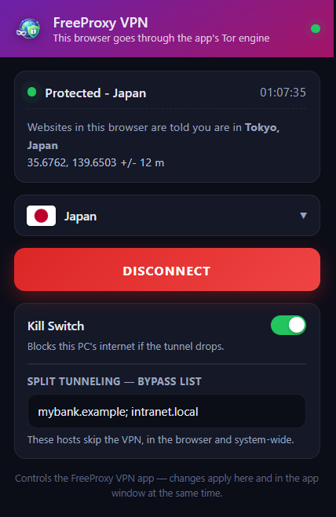
<p align="center"><sub>Kill switch and split-tunnel exceptions — the same lists as the app.</sub></p>
</td>
<td width="25%">
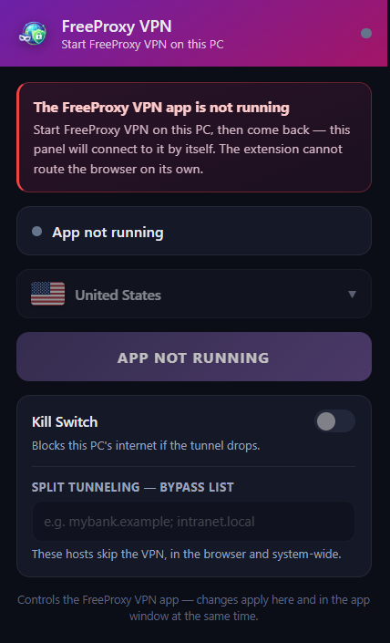
<p align="center"><sub>The app is not running: inert, and it says so instead of pretending.</sub></p>
</td>
<td width="25%">
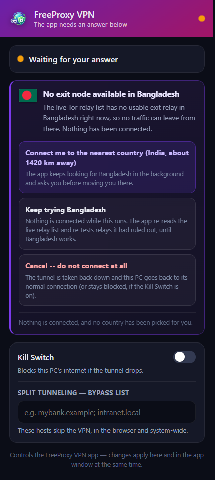
<p align="center"><sub>It stops and asks rather than connecting you somewhere you did not pick.</sub></p>
</td>
<td width="25%">
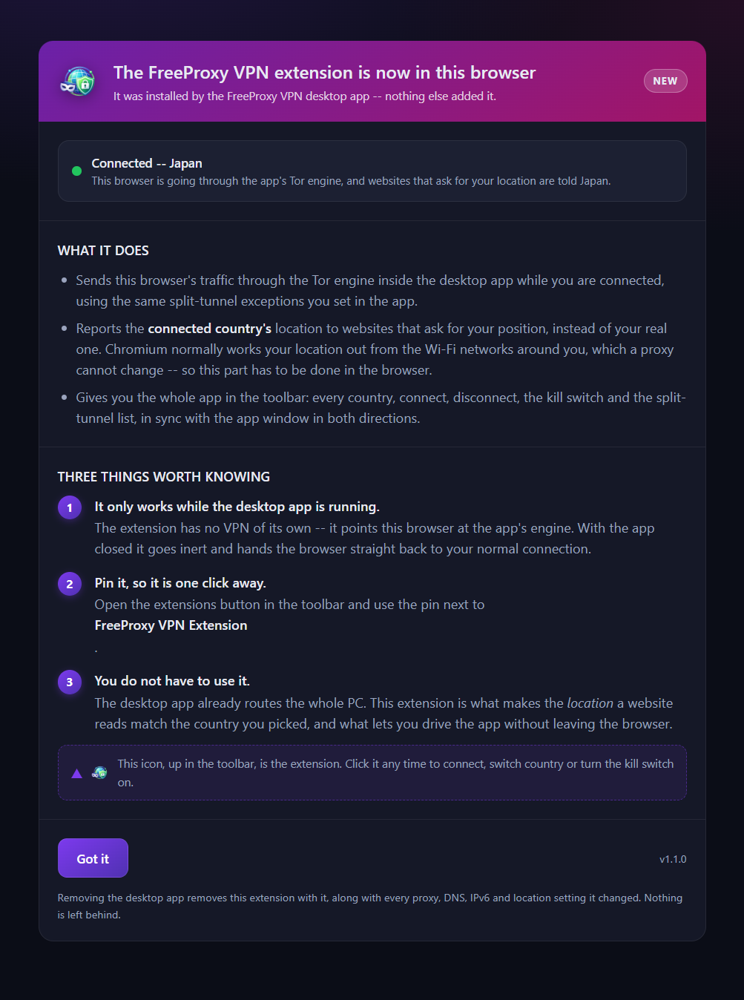
<p align="center"><sub>The welcome page, showing the live state of the app it depends on.</sub></p>
</td>
</tr>
</table>

The popup is a full second face for the app, not a status light: you can pick a
country, connect, disconnect, arm the kill switch and edit the split-tunnel list
from it. Everything it shows is derived from one state object the app pushes —
when the socket is down that object is `null`, and the popup goes inert rather
than showing a stale country.

### Every permission it asks for, and what each one is actually for

`Extension/manifest.json` asks for seven permissions and `<all_urls>`. That is a
lot, so here is each one and the single thing it does:

| Permission | Used for | Not used for |
|---|---|---|
| `<all_urls>` (host) | injecting the geolocation shim into **every page and every frame** at `document_start`, in both the MAIN and ISOLATED worlds. A page that reads your position before a later-injected script would win otherwise | reading page content. The extension issues **no** `fetch`, no `XMLHttpRequest` and no beacon — its only socket is `ws://127.0.0.1:8080` |
| `proxy` | pointing this browser's own proxy at `127.0.0.1:9050`, so it is covered even before the system proxy applies | anything else |
| `storage` | the connected country, its coordinates, an accuracy, and which origins were told a position — so the next switch knows what to clean up | any browsing history |
| `cookies` | deleting the `UULE` cookie by name. Google writes it; it carries a position, and it survives a tab close | writing any cookie. The extension sets none |
| `browsingData` | the country-switch wipe below | anything on a disconnect |
| `tabs` | reloading tabs after a switch so they ask for the position again, and rewriting a pinned `/maps/@lat,lng` URL | reading what you have open beyond that |
| `notifications` | exactly one notification, once, when the extension is first installed, saying which browser it just became active in | anything after that. There is no second `notifications.create` call in the extension |
| `alarms` | one periodic watchdog. If this browser is pointed at the Tor port and the app has stopped answering, the alarm releases the proxy so the browser is not left with no internet — and picks the socket back up, because a torn-down MV3 worker loses its `setTimeout` chain | keeping itself awake for its own sake |

### What a switch wipes, and why

When the country changes while connected, the extension runs this, in this order,
before it reloads anything:

1. **Delete every `UULE` cookie, by name, wherever it is.** Measured on
   2026-09-01: Google Maps centres from that cookie, not from
   `navigator.geolocation` — so a stale country survives a tab close and a
   browser restart unless the cookie goes.
2. **`chrome.browsingData.remove({ since: 0 }, { cache: true, cookies: true,
   history: true })`** — cache, cookies and history, browser-wide, over all of
   recorded time.
3. **Clear the site storage of every origin that was handed the old country**,
   then reload those tabs so they ask again.

Step 2 signs you out of everything, and that cost is stated rather than designed
around. A narrower version was tried and does not work: clearing per-origin only
reaches sites that had already asked for a position, and a page holding the old
country in a cached response, a history entry or a cookie set before the
extension existed is untouched by it — which was the original reported bug, where
a browser kept showing the *first* country it had ever connected to.

A cookie jar cannot be filtered by "does this cookie encode a location", because
nothing in a cookie says so. `UULE` is the one that was *measured* to carry a
position, and it is removed by name on a **disconnect** as well — where a full
wipe would not be proportionate, and so does not happen.

If `chrome.browsingData` is missing in a particular browser, the extension writes
to its own console that history, cache and cookies could not be cleared for that
switch, and carries on with the steps it *can* do. It does not report a wipe it
did not perform.


## Leak protection, and a kill switch that means it

<p align="center">
  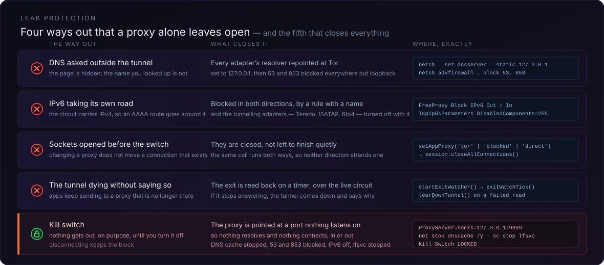
</p>

A SOCKS proxy on its own leaves four ways out. All four are closed before the
app says *connected* — that is stage **97** in the flow above, and the right-hand
column of that diagram is the actual command or call, not a paraphrase.

The fourth one is the one most tools skip. A proxy that has died still accepts
connections from the operating system's point of view, so applications keep
handing traffic to a hole in the ground. The app re-reads the exit on a timer
and tears the tunnel down on a failed read, rather than letting you keep
browsing through nothing.

> [!WARNING]
> **The kill switch is not a preference, it is a lock.** Armed, the system proxy
> is pointed at a port nothing listens on, the DNS cache service is stopped and
> ports 53 and 853 are shut — so nothing resolves and nothing connects, by
> design. *Disconnecting does not lift it.* Until you turn it off the machine
> has no internet, which is exactly what a kill switch is for, and the UI says
> `Kill Switch LOCKED` rather than leaving you to guess.

### Split tunnelling, applied live

<table>
<tr>
<td width="46%" valign="top">
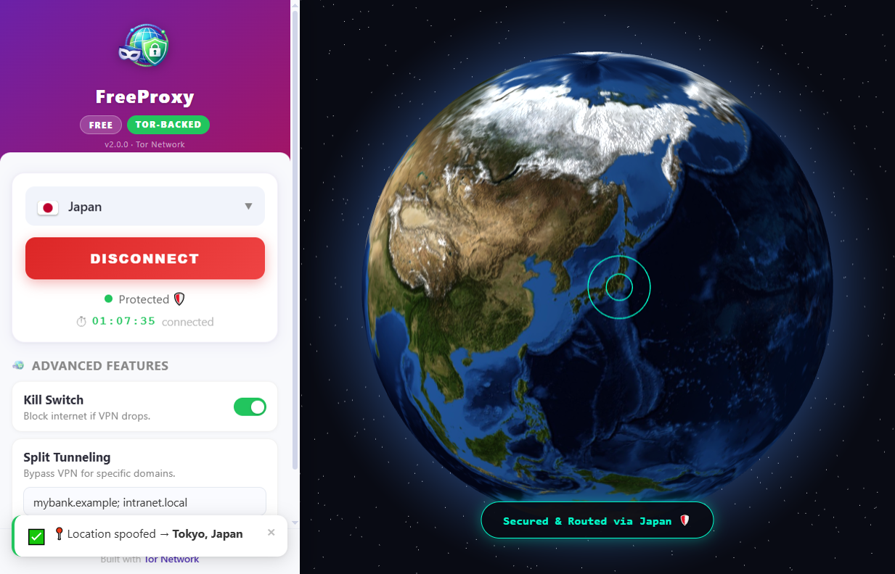
</td>
<td valign="top">

Some things have to stay off the tunnel: a bank that refuses foreign logins, a
streaming service that blocks Tor outright, an intranet name that does not
resolve anywhere but your office. Type them in, separated by `;`.

Each entry is normalised — scheme and path stripped, wrapped in `*…*` — and
written into `ProxyOverride` alongside `<local>`. Editing the list **while
connected** rewrites only that one value: no reconnect, no new circuit, no
dropped downloads.

Everything else keeps going to
`http=127.0.0.1:9080; https=127.0.0.1:9080; socks=127.0.0.1:9050`. That HTTP
tunnel entry matters more than it looks: applications that speak only HTTP
proxy get a proxy that actually speaks their protocol, instead of quietly
falling back to a direct, unproxied route.

</td>
</tr>
</table>


## When it cannot do what you asked

<table>
<tr>
<td width="33%" valign="top">
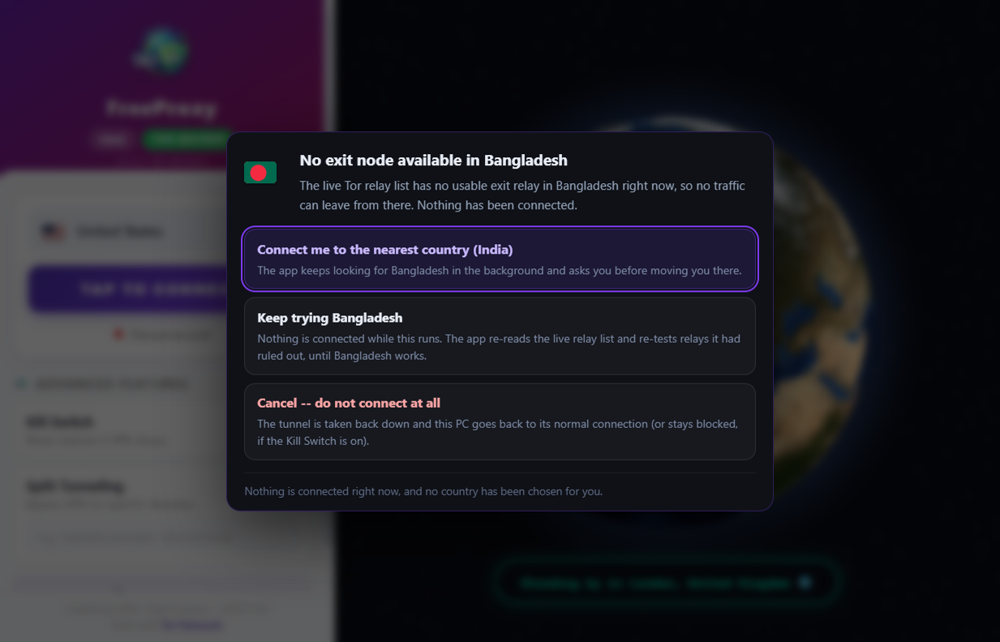
<p align="center"><b>No usable exit</b><br><sub>It asks, instead of silently substituting a country you did not choose.</sub></p>
</td>
<td width="33%" valign="top">
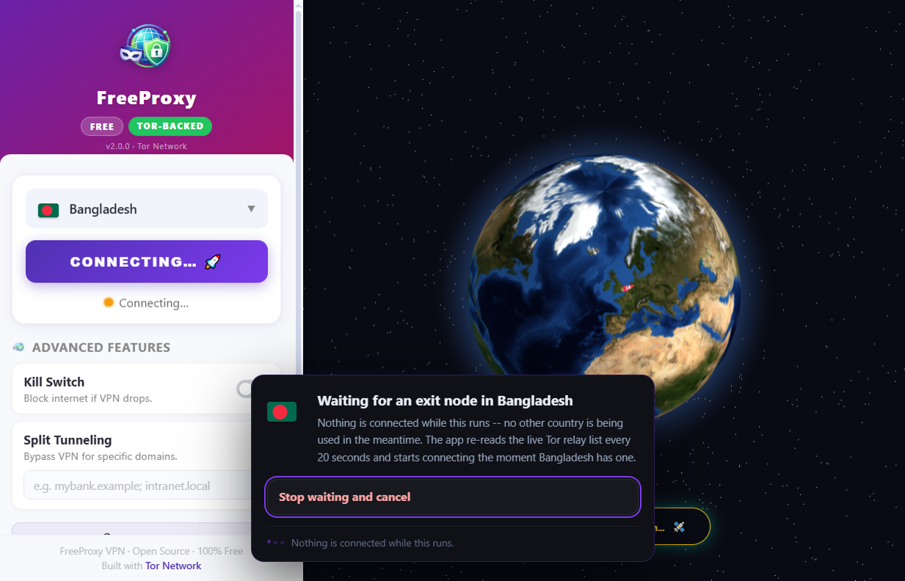
<p align="center"><b>Still trying</b><br><sub>Nothing is connected, it says so plainly, and it gives you a way out.</sub></p>
</td>
<td width="33%" valign="top">
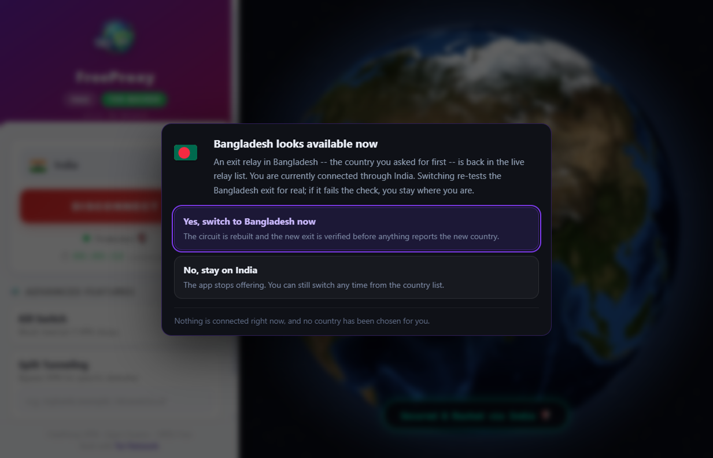
<p align="center"><b>It kept looking</b><br><sub>It found the country you asked for — and asks before moving you to it.</sub></p>
</td>
</tr>
</table>

Exit availability is a fact about the Tor network this minute, not a promise
anyone can make. A country that worked yesterday may have nothing usable today,
and the honest thing to do about that is say so.

A normal attempt walks the best **5** exit relays for your country. If none of
them work you are not moved somewhere else quietly — you are shown what is
actually available and asked. Choose to keep waiting and the search widens to
**12** relays per round, because at that point you have read the options and
picked, and the only wrong answer is giving up early. On a genuinely cold first
start, where there is no consensus cache yet, the engine is also allowed to
restart itself **twice** within **five minutes** with nothing on screen but
progress — measured recovery: 40.4 s of cold consensus, killed, then 22.9 s to
100%.

### obfs4 bridge mode — a maybe, not a rescue

If a direct connection stalls or times out and the automatic direct rounds are
spent, the app makes one more attempt through obfs4 bridges, using the bundled
`lyrebird.exe` and three hard-coded bridge lines.

This is written down the way it was measured rather than the way it would read
best. With the launch bug fixed, `lyrebird` does start — and all three of those
bridges then answered *"general SOCKS server failure"* for 25 seconds straight.
So the bridge round is the **last** automatic move, never an early one, and a
first connect is never allowed to depend on it. If your network blocks Tor
outright, this app may simply not get you through, and it will tell you that
instead of spinning a wheel at you.

The direct rounds are spent first for the same reason: those are the ones
measured to work.


## It writes down what it did

<table>
<tr>
<td width="45%" valign="top">

The log viewer is in the app: filterable by level, tailing the last 300 lines,
with a button that opens the folder in Explorer.

This log is the reason the coverage claims on this page can be **checked** rather
than believed. It names each browser, each route attempted and the result that
was read back afterwards. If the extension did not land in Brave, the log says
Brave, and says why.

`C:\ProgramData\freeproxy-vpn\logs\freeproxy-YYYY-MM-DD.log`, seven days kept,
then rotated. Nothing is uploaded — there is no server belonging to this project
to upload it to.

</td>
<td valign="top">
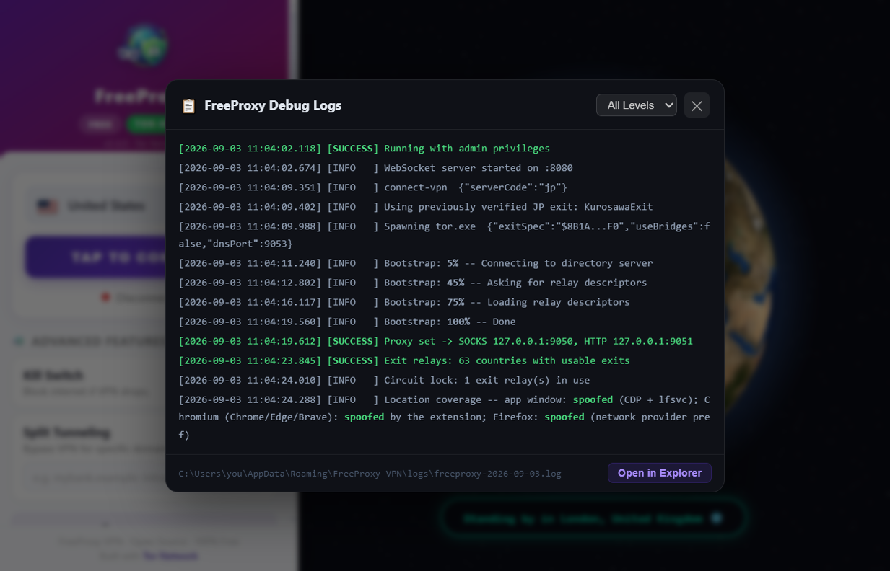
</td>
</tr>
</table>


## What it changes on your machine, and what it changes back

| Setting | While connected | Put back by |
|---|---|---|
| **System proxy** — `HKCU\…\Internet Settings` | `ProxyServer`, `ProxyEnable=1`, `ProxyOverride` | disconnect and uninstall: the values are **deleted**, and `ProxyEnable` set to `0` |
| **DNS**, per adapter | every adapter's resolver pinned to `127.0.0.1` | adapters reset to DHCP, the per-interface `NameServer` removed, `dnscache` started again |
| **Firewall** | 7 named rules — 2 allow, 4 block, 1 location shield | each deleted **by name**, so nothing else in your profile is touched |
| **IPv6** | binding off, `DisabledComponents=255`, Teredo / ISATAP / 6to4 off | binding on, `DisabledComponents=0`, all three tunnels back to `default` |
| **Location service** | `lfsvc` stopped, the sensor denied | `sc config lfsvc start= demand`, then the resolver cache flushed |
| **Chromium policy & external-extension entries** | the four routes above, for installed forks only | removed — and only where the entry's update URL is *this machine's own loopback*, so a workplace deployment survives untouched |
| **Gecko prefs** | `geo.provider.network.url` and the proxy prefs, per real profile | restored from the revert journal, which is the only step that can put back what *you* had rather than a Windows default |
| **hosts file** | one marked block | removed line by line between its markers; hand-written entries above and below survive byte for byte |
| **Certificates** | one, if the geo shield needed it | removed from all six stores, matched on this app's `FriendlyName` or on a **self-signed** `CN=www.googleapis.com`, which a real Google certificate never is |
| **Scheduled tasks** | `FreeProxy VPN Boot Setup`, `FreeProxy VPN Extension Delivery` | deleted, including the belt-and-braces pass that needs no executable |
| **Files** | `C:\ProgramData\freeproxy-vpn`, `%LOCALAPPDATA%\FreeProxy VPN` | removed on uninstall — Tor state, logs, the staged extension **and the RSA signing key** |

> [!NOTE]
> **The proxy row is a deletion, not a restore, and that is worth saying out
> loud.** No version of this app ever took a snapshot of your previous proxy
> setting, so on the way out it removes what *it* wrote instead of pretending to
> put back something it never read. If you were using a proxy of your own before
> installing this, you will need to set it again. Everything else in that table
> either restores a Windows default or replays the app's own revert journal.

The uninstaller is written so that every one of those reverts still happens
**even if the program files are already gone** — electron-builder does not
promise they survive to that point. The registry sweep walks
`HKLM\Software\Policies` by *shape* rather than by a list of vendor paths, in
both registry views, so a Chromium fork nobody has heard of yet is cleaned too,
and a policy entry that is not provably ours is left exactly where it is.


## Everything it talks to

The complete list. There is no server belonging to this project, so there is
nothing here that phones home.

| Host | Why | When |
|---|---|---|
| `onionoo.torproject.org` | the live relay index — which countries have usable exits, and how many | on start, and when you open the country list |
| `ipleak.net`, `get.geojs.io`, `api.country.is`, `ipinfo.io` | to read back **where the circuit actually came out**, asked *through* the circuit itself | stage 98 of every connect and every switch |
| `free.freeipapi.com`, `ipwho.is`, `get.geojs.io`, `api.ipbase.com` | to place the "you are here" ring before any tunnel exists, tried in that order | once, while idle — if none answer, nothing is drawn |
| `aka.ms` | the Visual C++ redistributable, **only** if the bundled copy is missing from the installer | install time only |

Two more are links, not requests: the *verify privacy* button opens
`https://ipleak.net/` and the footer opens `https://www.torproject.org` — in your
default browser, through the handler that refuses anything that is not `https`.

> [!TIP]
> If you grep the source you will also find `clients2.google.com`,
> `edge.microsoft.com`, `www.google.com`, `www.googleapis.com` and
> `schemas.microsoft.com`. **None of them is contacted by this app.** The first
> two are store update URLs written *into policy* for a store-hosted route this
> build does not use; `www.googleapis.com` appears only in code that *removes* a
> certificate an earlier build left behind; the last two are XML namespaces.


## Build it yourself

```bash
git clone https://github.com/Zero-Asif/FreeVPN-PC-App.git
cd FreeVPN-PC-App
npm install
```

| Command | What you get |
|---|---|
| `npm start` | runs from source. Use an **elevated** terminal, or the system-level steps will fail honestly instead of silently |
| `npm run pack` | an unpacked build in `release/win-unpacked`, no installer |
| `npm run dist` | `release/FreeProxy-VPN-Setup-2.0.0.exe` — NSIS, per-machine, `requireAdministrator` |

Runtime dependencies are one package: `ws`. Everything else is Electron,
electron-builder and what is already vendored in the repository — `tor.exe`,
`lyrebird.exe`, the globe libraries, the flag set and the Visual C++
redistributable.

### The probe suite

`.build/` holds **111** scripts named `test-*` or `probe-*`. They are not unit
tests and there is no framework. Each one drives the real thing — the real
registry, a real browser profile, the real `tor.exe`, the real uninstall sweep —
and then reads the result back out of the machine, because that is the only kind
of check that can tell you whether an extension actually landed.

| Script | What it covers |
|---|---|
| `probe-readme-art.js` | every SVG on this page, rendered the way GitHub renders it — on white **and** on `#0d1117`, from a blob, one frame into its animation |
| `probe-readme-shots.js`, `probe-readme-popup.js` | the 19 screenshots above, driven through the real `index.html`, `Extension/popup.html` and `Extension/welcome.html` |
| `probe-readme-links.js` | every local link, every in-page anchor and every `file#Lnnn` reference in every markdown document here — a heading reworded three sections away kills a link silently |
| `probe-md-html.js` | the raw HTML in those documents. GitHub renders broken markup rather than refusing it, and one unclosed `<td>` swallows the rest of the page into a table cell |
| `test-geo-e2e.js` | the geolocation path from the app to a page's `navigator.geolocation` |
| `test-installer-sweep.js` | the uninstaller's registry sweep, redirected onto a throwaway key so it can be run at all |
| `make-badges.js` | the 12 badges at the top, every value read out of the project rather than typed |

Some need elevation, some need a particular browser installed, some need a port
to be free. They print what they measured.
[`docs/media/README.md`](docs/media/README.md) has the exact commands for the
ones this page depends on — including what in the screenshots is a fixture, and
why.


## Every interface, listed

<details>
<summary><b>The 18 IPC channels between the window and the main process</b></summary>

| Channel | Does |
|---|---|
| `connect-vpn` | [`main.js:4123`](main.js#L4123) — connect to a country, with the split-tunnel list |
| `switch-vpn` | [`main.js:4247`](main.js#L4247) — change country **without** dropping the tunnel |
| `disconnect-vpn` | [`main.js:4138`](main.js#L4138) — tear down, or hold the block if the kill switch is armed |
| `toggle-killswitch` | [`main.js:4197`](main.js#L4197) — arm or release the lock |
| `update-live-bypass` | [`main.js:4214`](main.js#L4214) — rewrite `ProxyOverride` only, live |
| `get-realtime-status` | [`main.js:4068`](main.js#L4068) — the country table, exit counts and bandwidth |
| `get-geo-coords` | [`main.js:1948`](main.js#L1948) — the coordinate table the spoof reads from |
| `get-home-location` | [`main.js:1966`](main.js#L1966) — where the idle globe centres |
| `report-killswitch` | [`main.js:1986`](main.js#L1986) — the renderer telling the main process what it shows |
| `get-pending-ask` / `ask-user-answer` | [`1593`](main.js#L1593) / [`1584`](main.js#L1584) — the question, and your answer to it |
| `get-log-lines` | [`main.js:1883`](main.js#L1883) — the tail behind the log viewer, with the level filter |
| `open-log-folder` | [`main.js:1886`](main.js#L1886) — Explorer, at the log directory |
| `open-geo-ext-folder` | [`main.js:1890`](main.js#L1890) — the staged extension and `HOW-TO-ENABLE.txt` |
| `get-pending-restart` | [`main.js:1904`](main.js#L1904) — the marker the installer may have left, read once |
| `dismiss-pending-restart` | [`main.js:1912`](main.js#L1912) — *Later*, and it stays later |
| `restart-windows` | [`main.js:1917`](main.js#L1917) — *Restart now*, and only ever from that click |
| `get-fastest-server` | [`main.js:1896`](main.js#L1896) — **a stub.** It returns a fixed answer and measures nothing; see [Known limitations](#known-limitations-and-open-defects) |

</details>

<details>
<summary><b>What the extension popup can ask the app to do</b></summary>

Six commands, over the loopback WebSocket. The popup can do everything the main
window can do to a connection.

| Command | Does |
|---|---|
| `CONNECT` / `DISCONNECT` | the same two paths the window's own button takes |
| `CHANGE_SERVER` | switch country, without dropping the tunnel |
| `TOGGLE_KS` | arm or release the kill switch |
| `UPDATE_BYPASS` | replace the split-tunnel list |
| `ASK_ANSWER` | answer the app's question from the popup instead of the window |

When the socket is down the popup's state object is literally `null`, and every
word on the page derives from that — which is why it goes inert instead of
showing you a country that is no longer true.

</details>

<details>
<summary><b>Command-line flags and exit codes</b></summary>

The app is its own installer helper. These are run *by* the installer, the
uninstaller and two scheduled tasks — never by hand in normal use.

| Flag | Runs |
|---|---|
| `--fp-setup` | install-time: detect browsers, sign the `.crx`, write the entries, schedule the boot pass |
| `--fp-teardown` | uninstall-time: replay the revert journal, remove the tasks and the entries |
| `--fp-boot` | the boot pass, as SYSTEM, before any browser has started |
| `--fp-deliver` | the logon helper that serves the package on `127.0.0.1` |
| `--fp-reboot-pending` | a modifier on `--fp-setup`: *Windows itself* said a restart is pending |

| Code | Means |
|---|---|
| `0` | done |
| `1` | crashed |
| `3` | staging the extension failed |
| `4` | timed out |
| `10` | manual step needed — normal on an unmanaged PC, **not** a failure |
| `11` | a restart is advised, and will be **offered**, never taken |

</details>

<details>
<summary><b>Where things live in the repository</b></summary>

```
main.js                   the main process: torrc, tunnel, leak guard, IPC, asks
renderer.js               the window: globe, badge, country list, log viewer
index.html  style.css     the one window
globe-controller.js       the globe, on three.js + globe.gl
installer.nsh             NSIS hooks — and not one browser-specific registry path
lib/
  browsers.js             the 14 browsers, and how to find them on this PC
  geo-ext.js              the four extension routes, written and read back
  geo-spoof.js            the coverage table this README's diagram is drawn from
  crx.js                  RSA key, CRX signing, the id that comes out of it
  ext-host.js             the one-time loopback server that hands over the package
  ext-deliver.js          the logon delivery task
  installer-tasks.js      --fp-setup / --fp-teardown / --fp-boot / --fp-deliver
  tor-control.js          the control port, cookie auth
  exit-selector.js        which relay, for which country, and what was verified
  socks-fetch.js          asking a question *through* the circuit
  home-location.js        the idle globe's "you are here"
  offthread.js            keeping the window responsive during a cold connect
Extension/                the bundled MV3 extension
Extension-Store/          the same extension, packaged for store submission
Tor/                      tor.exe 0.4.9.6 and lyrebird.exe, as shipped
docs/media/               every image on this page, and the script that made it
.build/                   111 probes, the screenshot harnesses, the art gate
```

</details>


## Known limitations and open defects

These are here because a page that only lists what works is not documentation.

**Limits of the platform, not of the effort**

* **Native Windows geolocation cannot be spoofed.** There is no supported way to
  inject coordinates into the Windows location provider — measured, including
  the documented *Default Location* setting, which changes nothing the provider
  reports. Non-browser applications get a **withheld** position, never a fake
  one.
* **An off-store extension cannot be force-installed on an unmanaged PC.**
  Chrome, Brave *and* Edge all require domain-join, Azure-AD-join or Chrome
  Browser Cloud Management. What lands instead is the external-extensions offer
  at the next browser start; where nothing automatic can work you get one click,
  once.
* **obfs4 bridge mode is a maybe.** All three bundled bridges answered "general
  SOCKS server failure" for 25 s straight when measured. A network that blocks
  Tor may simply block this.
* **Tor is not a bandwidth service.** Browsing is fine; large downloads and
  video are slower than a commercial VPN. That is the cost of having nobody to
  trust.
* **Your previous proxy setting is not restored**, because no version of this app
  ever recorded it. It removes what it wrote.
* **Windows 10 / 11, x64 only.** There is no macOS or Linux build and this
  README will not pretend one is coming.

**Three open defects, reported instead of quietly patched**

Two of them are visible in the screenshots above. They were left in frame on
purpose: airbrushing a README is how a project starts lying about itself.

| Where | What is wrong | The fix |
|---|---|---|
| [`main.js:1896`](main.js#L1896) | `get-fastest-server` returns `{ best: 'sg', others: ['hk','jp'] }` unconditionally, and [`renderer.js:824`](renderer.js#L824) paints a `BEST` badge from it. **Nothing is timed.** Worse, Tor exit throughput is not rankable from a sample — measured: within-relay spread matches between-relay spread, so onionoo's own order is already as good as this can get. | Drop the badge, or replace it with something that is actually measured. It is not described as a feature anywhere on this page. |
| [`main.js:3014`](main.js#L3014) | the "your country is available again" ask passes no `foot`, so [`renderer.js:664`](renderer.js#L664) falls back to the idle line — the footer reads *"Nothing is connected right now…"* directly under a body that says *"You are currently connected through India."* Visible in `09-comes-back.png`. | one `foot:` on that object |
| [`Extension/welcome.html:150`](Extension/welcome.html#L150) | `ol.steps li b { display: block; }` also matches the inline `<b>FreeProxy VPN Extension</b>` on line 257, so a full stop ends up alone on its own line. Visible in `30-welcome.png`. | `ol.steps li > b:first-child` |

<p align="center"></p>

## Questions people actually ask

<details>
<summary><b>Is it really free? Where is the catch?</b></summary>

<br>

There is no account, no subscription, no trial, no e-mail box to fill in, and no
server belonging to this project — which is the honest reason it can be free.
The bandwidth is donated by the volunteers who run Tor relays. What you give up
instead of money is speed, and the fact that a small number of sites treat
known Tor exits with suspicion.

</details>

<details>
<summary><b>Why does it need administrator rights?</b></summary>

<br>

Four of the things it does are machine-wide, and Windows will not let a normal
process do any of them: writing DNS servers onto every adapter, adding firewall
rules, blocking IPv6, and writing extension policy under `HKLM`. It asks once,
at install, and the elevated work is done by a short-lived child process rather
than the window you are looking at — see the block budget in
[**How it works**](#how-it-works).

</details>

<details>
<summary><b>Why does my browser ask me to turn the extension on?</b></summary>

<br>

Because on a personal PC that is the only way in. Measured on 2026-09-01:
Chrome, Brave **and** Edge all refuse to force-install an extension that did
not come from their web store unless the machine is domain-joined,
Azure-AD-joined or CBCM-enrolled. So the app delivers the extension by the one
route that does reach an unmanaged browser, and that route lands it **disabled**
— one click from you, once, per browser. It never disables it again afterwards.

</details>

<details>
<summary><b>Does it log what I do?</b></summary>

<br>

It writes a local log of what **it** did — the torrc it wrote, the registry keys
it touched, the exit country it read back — so that every claim on this page can
be checked on your own machine instead of taken on trust. It records no browsing
history and no destination you visited, and nothing is uploaded anywhere,
because there is nowhere to upload it to. The file is plain text at
`C:\ProgramData\freeproxy-vpn\logs\`, seven days are kept, and
[**It writes down what it did**](#it-writes-down-what-it-did) shows the viewer.

</details>

<details>
<summary><b>Is this Tor Browser?</b></summary>

<br>

No, and it is not a replacement for it. Tor Browser solves a different problem:
it makes your *browser* look like every other Tor Browser, so a site cannot
fingerprint you. It does nothing for the rest of your machine. This app routes
the whole machine through Tor and fixes the thing Tor Browser deliberately does
not touch — geolocation, per browser, per profile. If your threat model is a
site fingerprinting your browser, use Tor Browser. If it is *everything on this
PC should leave through Tor and stop broadcasting where I am*, this is that.

</details>

<details>
<summary><b>Can a website still tell where I am?</b></summary>

<br>

Yes, by other means, and this page will not pretend otherwise. What is closed is
the IP address, the DNS query, the browser geolocation API and the Windows
location service. What is **not** closed: your system timezone, your browser's
language and `Accept-Language` header, canvas and font fingerprinting, and — most
of all — any account you are already signed into. Google knows where you live
because you told it, not because it looked.

</details>

<details>
<summary><b>Why 74 countries and not all of them?</b></summary>

<br>

74 is the number of entries in `GEO_COORDS` at
[`main.js:125`](main.js#L125) — the table of coordinates the app hands to the
extension when it spoofs a position. A country is listed only if it has a
coordinate to hand over, so that the browser is never told a location the app
made up. Tor itself has exits in more places; the badge counts what can be
*spoofed*, not what can be *routed*.

</details>

<details>
<summary><b>Will it slow everything down, not just my browser?</b></summary>

<br>

Yes. That is the point of a system proxy, and it is the honest cost: every
program on the machine goes through three volunteer relays. If one app needs its
real speed — a bank that refuses Tor, a work intranet, a game — put its domain
in the split-tunnel box and it leaves your normal connection instead, live,
without disconnecting. See
[**Split tunnelling, applied live**](#split-tunnelling-applied-live).

</details>

<details>
<summary><b>What if the app crashes while I am connected?</b></summary>

<br>

Everything it changed is written to a journal *before* it changes it, so the next
start knows exactly what to put back rather than guessing at defaults.
`startupCleanup()` at [`main.js:745`](main.js#L745), called from
[`main.js:1837`](main.js#L1837), kills any stale `tor.exe`, restores the recorded
location setting, removes the proxy, clears the DNS pins, drops the IPv6 and DNS
firewall rules and restarts `dnscache`. If it finds no journal it still reverts
all of that — it simply will not touch your location setting, because forcing
*Allow* would quietly switch location on for someone who keeps it off.

</details>

<p align="center"></p>

## The rest of the paperwork

<table>
<tr>
<td width="33%" valign="top">

### 📄 [CONTRIBUTING.md](CONTRIBUTING.md)

How to build it, where each part lives, what the probe suite expects of a change,
and the one rule that matters most here: **a claim goes in only after a read-back
proved it.**

</td>
<td width="33%" valign="top">

### 🤝 [CODE_OF_CONDUCT.md](CODE_OF_CONDUCT.md)

Contributor Covenant 2.1, with the enforcement ladder spelled out rather than
implied.

</td>
<td width="33%" valign="top">

### ⚖️ [LICENSE.txt](LICENSE.txt)

MIT, for this app's own code. The engine it drives is not MIT — see the notices
below.

</td>
</tr>
<tr>
<td valign="top">

### 🔒 [PRIVACY_POLICY.md](PRIVACY_POLICY.md)

The short version is on this page already: no account, no telemetry, no server of
this project. This is the long version.

</td>
<td valign="top">

### 📚 [THIRD-PARTY-NOTICES.md](THIRD-PARTY-NOTICES.md)

Every bundled component and its licence — Tor and its own dependencies,
lyrebird, three.js, globe.gl, `ws`, Electron, the flag icons and the earth
textures.

</td>
<td valign="top">

### 🧪 [docs/media/README.md](docs/media/README.md)

Every picture on this page, which script generated it, and the complete list of
the six values in the screenshots that are fixtures rather than real.

</td>
</tr>
</table>

## Standing on other people's work

This app is a control panel. Almost everything that makes it *work* was written
by someone else, and none of it asked to be involved:

- **The Tor Project** — `tor.exe` 0.4.9.6 and `lyrebird` (obfs4) do the actual
  anonymity. This app writes a torrc and reads a control port; that is the whole
  of its cleverness.
- **The relay operators** — several thousand volunteers paying for the bandwidth
  you are about to use. If this app is useful to you,
  [run a relay](https://community.torproject.org/relay/) or
  [donate](https://donate.torproject.org/) to the people whose machines are
  carrying it.
- **`onionoo.torproject.org`** — the relay directory this app reads to know which
  countries have exits at all.
- **[three.js](https://threejs.org/) r147** and
  **[globe.gl](https://github.com/vasturiano/globe.gl) 2.27.2** — the globe.
- **[Electron](https://www.electronjs.org/) 41.3.0** and
  **[ws](https://github.com/websockets/ws) 8.20.0** — the shell and the one
  runtime dependency.
- **[flag-icons](https://github.com/lipis/flag-icons)** — 74 flags that are not
  emoji, because Windows does not render flag emoji.

<p align="center"></p>

<div align="center">

**FreeProxy VPN** 2.0.0 · MIT · Windows 10 and 11 · no account, no telemetry, no
server of this project

Built by [Zero-Asif](https://github.com/Zero-Asif) ·
[report something](https://github.com/Zero-Asif/FreeVPN-PC-App/issues) ·
[read the code](https://github.com/Zero-Asif/FreeVPN-PC-App)

<sub>Tor is a registered trademark of The Tor Project, Inc. This is an
independent project and is not affiliated with, endorsed by, or supported by
The Tor Project.</sub>

<sub>Every number, port, path and line reference on this page was read out of the
source in this repository, not remembered. Where a check could not be run, this
page says so instead of rounding it up.</sub>

</div>

